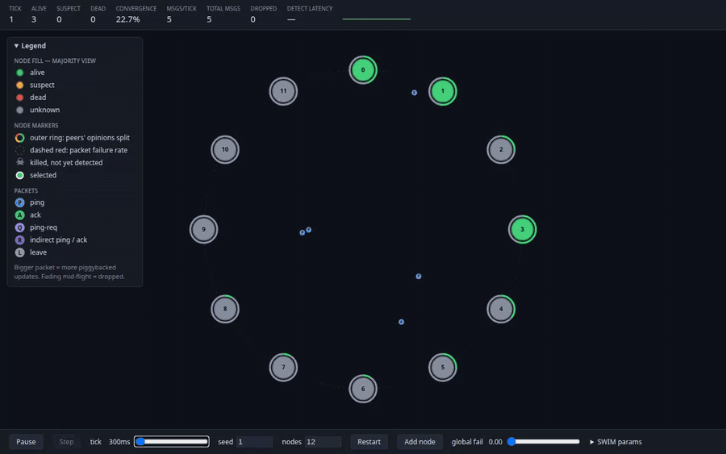

# Gossip Protocol Simulator & Visualizer

A browser-based teaching and exploration tool that simulates [SWIM](https://www.cs.cornell.edu/projects/Quicksilver/public_pdfs/SWIM.pdf)-style gossip membership (with the [Lifeguard](https://arxiv.org/abs/1707.00788) local-health extension) across a cluster of virtual nodes and animates the protocol traffic in real time.

The purpose of this simulator is to play around and experiment with gossip protocols: watch how information spreads through the cluster, how fast (and whether) membership views converge, and how failures, packet loss, partitions and churn affect detection and dissemination. Tweak the parameters, break things, and see what happens.

**Live demo:** https://nazarii-piontko.github.io/gossip-visualizer/

[](https://nazarii-piontko.github.io/gossip-visualizer/)

**Stack:** Vite 8 + React 19 + TypeScript 7 (strict), no runtime dependencies beyond React. Pure-TS simulation engine + React/SVG visualization layer. Vitest + Testing Library, 140+ tests.

## Quick Start

```bash
npm install
npm run dev          # Opens http://localhost:5173
npm test             # Run test suite once
npm run test:watch   # Tests in watch mode
npm run lint         # oxlint
npm run build        # Type-check + production build
npm run preview      # Serve the production build
npm run demo:record  # Re-record docs/demo.gif (needs ffmpeg; optional URL arg)
```

## How SWIM Works

The simulation runs in discrete ticks; every message takes exactly one tick to arrive. SWIM detects failures and spreads membership updates through gossip. Here's the cycle (timeouts shown at LHM = 0):

### Probe & Detect

Each node probes its peers round-robin (shuffled order, suspects included), starting a new probe every `protocolPeriod` ticks at its own random phase offset.

1. **Ping** (tick T): Node A picks target B and sends a ping.
2. **Ack** (tick T+2): B receives the ping at T+1 and replies; the ack reaches A at T+2.
3. **Indirect probes** (tick T+2): If no ack arrived, A sends `ping-req` to up to k=3 random alive peers.
4. **Relay** (ticks T+3–T+6): Each relay pings B and forwards any ack back to A. If neither a direct nor an indirect ack arrives by T+6, A marks B **suspect**.
5. **Dead**: If B stays suspect for the suspicion timeout — ⌈`suspicionMult` · log10(max(n, 10)) · `protocolPeriod`⌉ ticks, where n is the number of members the node knows (24 ticks at ≤ 10 nodes, 26 for the default 12) — it is marked **dead**. Dead entries are pruned from the table after 50 ticks.

### Refutation

When a node hears that it is suspected (or declared dead), it increments its own incarnation number and gossips `alive` at the new incarnation. A higher incarnation always wins; at equal incarnation the graver state wins (dead > suspect > alive). So false positives visibly recover. Any message to a suspect/dead peer also echoes that peer's current state, so it can always learn about — and refute — its own suspicion.

### Local Health (Lifeguard LHM)

A node that cannot reach others is a bad judge of who is dead. Each node keeps a **local health multiplier** (LHM, 0 to `lhmMax − 1`, i.e. 0–7 by default): it goes up when the node's own probe fails outright or when it has to refute a suspicion about itself, and down on each successful probe. The ack deadline, probe deadline, suspicion timeout and probe interval all scale by `1 + LHM`, so an isolated node's verdicts slow down instead of declaring the whole cluster dead — the poisoning that would otherwise spread when the partition heals.

### Piggyback Dissemination

There is no separate gossip message type. Every message carries up to 6 membership updates, least-sent first (infection-style broadcast). Each update is retransmitted up to 8 times before eviction; a fresher update about the same node replaces it and resets its count.

### Join, Leave, Rejoin

- **Join:** a new node starts with 3 random running peers as seeds and gossips its own `alive`.
- **Graceful leave:** the node sends `leave` to every peer it believes alive; recipients mark it dead immediately, skipping the suspect phase.
- **Rejoin:** after a long isolation both sides may have pruned each other; rejoin hands the node a fresh seed list and re-announces it.

**Full spec:** [docs/superpowers/specs/2026-08-13-gossip-simulator-design.md](docs/superpowers/specs/2026-08-13-gossip-simulator-design.md)

## UI Guide

A collapsible **Legend** next to the ring explains every color and marker.

### Ring

Nodes sit evenly spaced on a circle ordered by id; they glide to new positions as the cluster grows or shrinks, and shrink in size as the ring gets crowded.

Node fill shows the **majority view** across running nodes:

- **Green** — alive
- **Amber** — suspect
- **Red** — dead
- **Gray** — unknown (most peers have no entry)

Markers:

- **Outer donut** — how the other running nodes see this node (alive / suspect / dead / unknown fractions)
- **Dashed red ring** — node has a packet failure rate > 0 (opacity = max of in/out rate)
- **Skull** — killed, but the majority has not yet marked it dead
- **White outline** — selected node

### Packets

Each message is a colored dot with a letter, flying along a curved arc (A→B and B→A take different curves):

- **P, blue** — ping
- **A, green** — ack
- **Q, violet** — ping-req
- **R, faded violet / green** — indirect leg (relay's ping / ack)
- **L, gray** — graceful leave
- **Fade at ~60% of the arc** — dropped message

Dot size grows with piggyback payload. Animations pause with the simulation; **Step** plays out a single tick.

### Node Inspector (click a node)

- Running/killed badge, incarnation, local health (LHM), phase offset
- Failure-rate sliders (in / out)
- Actions: **Isolate** (100% in/out loss), **Heal**, **Kill** (crash-stop), **Leave (graceful)**, **Rejoin**
- Membership view as this node sees it: state, incarnation, ticks since last update; rows disagreeing with ground truth are red
- **Doubted by** — which peers see this node as suspect, dead or unknown
- Probes in flight: target, start tick, direct or indirect
- Counters: sent/received per message type, dropped outbound, false suspicions, refutations

### Global Stats (top bar)

- Tick
- Alive / suspect / dead counts (majority view)
- **Convergence %** — fraction of (viewer, peer) beliefs matching ground truth
- Messages this tick, total messages, total dropped
- Detection latency — ticks from the last kill until every running node marks it dead
- Convergence sparkline (last 100 ticks)

### Controls (bottom bar)

- **Play / Pause / Step** — run at the tick rate, pause, or advance one tick while paused
- **Tick slider** — 200–5000 ms per tick (default 2000 ms)
- **Seed + nodes + Restart** — deterministic replay: same seed and same actions give the same run (1–50 nodes)
- **Add node** — grow the cluster
- **Global fail slider** — link drop probability for all messages (0–100%)
- **SWIM params drawer** — live-edit `protocolPeriod`, `indirectProbes` (0 = direct only), `suspicionMult`, `maxPiggyback`, `seedCount`, `lhmMax` (0 or 1 = Lifeguard off); applied from the next tick

A message's drop chance combines global, sender-outbound and receiver-inbound rates independently.

## Defaults

| Parameter | Default | Notes |
|---|---|---|
| tick length (UI) | 2000 ms | 200–5000 ms range |
| initial cluster | 12 nodes | seed 1 |
| `protocolPeriod` | 6 ticks | ticks between a node's probes (≥ probe deadline); scales by 1 + LHM |
| ack deadline | 2 ticks | before escalating to ping-req; scales by 1 + LHM (constant) |
| probe deadline | 6 ticks | before marking suspect; scales by 1 + LHM (constant) |
| `indirectProbes` (k) | 3 | relays per failed direct probe |
| `suspicionMult` | 4 | suspect → dead after ⌈4 · log10(max(n, 10)) · period⌉ ticks (24 at ≤ 10 nodes, 32 at 20); scales by 1 + LHM |
| `maxPiggyback` | 6 updates | per message |
| `piggybackRetransmits` | 8 sends | before eviction (not exposed in UI) |
| `seedCount` | 3 peers | initial seeds for a joining node |
| `lhmMax` | 8 | LHM ≤ lhmMax − 1, so timeouts stretch at most 8×; 0 or 1 disables |
| `deadPruneTicks` | 50 ticks | dead entries removed after this (not exposed in UI) |
| failure rates | 0 | no drops by default |

## Architecture

**Two hard-bounded layers:**

- **`src/sim/`** — Pure TypeScript simulation engine (no React/DOM imports), fully testable headless.
  - `simulator.ts` — `Simulator`: message transit, drop injection, churn, per-tick reports
  - `node.ts` — `SwimNode`: protocol logic for one member
  - `membership.ts` — supersedence rules; `piggyback.ts` — dissemination buffer
  - `stats.ts` — omniscient snapshot (majority view, opinions, convergence); `rng.ts` — seeded PRNG (mulberry32)
- **`src/viz/`** — React layer rendering immutable per-tick `TickReport`s as SVG.
  - `useSimulation.ts` — `SimController` (play/pause timer, external store for `useSyncExternalStore`)
  - `Ring`, `Packets`, `NodeInspector`, `GlobalStats`, `Controls`, `Legend`

Simulator API:

```ts
const sim = new Simulator({ seed: 1, nodeCount: 12, swim: { indirectProbes: 3 }, globalFailureRate: 0 });
const report = sim.tick();          // { tick, events, packets, snapshot }
sim.addNode();                      // returns new NodeId
sim.killNode(id);                   // crash-stop
sim.removeNode(id);                 // graceful leave
sim.rejoinNode(id);
sim.setGlobalFailureRate(0.1);
sim.setNodeFailureRate(id, { in: 1, out: 1 });
sim.updateSwimParams({ protocolPeriod: 8 });
sim.getNodeDetail(id);              // inspector data
```

## Open Questions & Additional Work

Known gaps between this simulator and production SWIM implementations (HashiCorp memberlist, Uber Ringpop). None of these are bugs in what is implemented. They're things that aren't modeled yet, or behavior that's worth questioning.

### Protocol

- **No anti-entropy (full-state sync).** Membership moves only as piggybacked updates (≤ 6 per message), and each retires after 8 sends, counted at send time even if the message is dropped. Once gossip dies out, two nodes whose views differ never find out. Example: a node isolated for a while uses up its own suspicion updates on dropped messages. After the heal, the suspected peer only learns of it through direct contact, so the suspicion often expires into a temporary false dead (about half of seeds in the isolation integration scenario). Options:
  - *memberlist push-pull:* every K ticks, swap the full table with one random alive peer, importing remote `dead` as `suspect`.
  - *Ringpop checksum sync:* every message carries a checksum of the sender's table; on mismatch with no pending gossip, the reply carries the full table, plus a reverse sync.
- **Join transfers no state.** The Simulator writes seeds straight into the new node's table. The new node learns the rest of the cluster only gradually, from gossip and from being probed. memberlist does a push-pull with the seed node on join.
- **No Lifeguard dynamic suspicion.** Only Lifeguard's local health multiplier (LHM) is implemented. In Lifeguard, a suspicion starts at a long timeout (memberlist: 6× the minimum) and shortens only as other nodes independently confirm it. Without that, an unconfirmed suspicion from a node that was recently unhealthy expires as fast as a confirmed one.
- **No nack.** A Lifeguard relay sends a nack when it can't reach the target in time. That lets the prober tell "target is down" apart from "my own network is bad", and raise its LHM only in the second case. Here every failed probe raises LHM.
- **Retransmit limit doesn't scale with cluster size.** It's a flat 8 sends. memberlist uses `RetransmitMult · ⌈log10(N+1)⌉`; Ringpop uses `15 · ⌈log10(N+1)⌉`. The suspicion timeout scales with N; the dissemination budget doesn't.
- **Resurrection after pruning?** Dead entries are dropped after 50 ticks. A pruned node has no entry, so a late `alive` about it would be accepted again as new. That should be rare, since gossip about it has usually retired by then, but it isn't tested. memberlist keeps dead entries and keeps gossiping to recently dead nodes (`GossipToTheDeadTime`); Ringpop keeps faulty members for 24h.
- **Suspicion timeout sizes N from the table, dead entries included.** memberlist uses its estimate of live nodes. That makes timeouts slightly longer right after a large failure.
- **New peers wait for the next round-robin pass.** SWIM inserts newly learned members at a random position in the current probe list.

### Membership lifecycle

- **No automatic reconnect.** An orphaned node (one whose table emptied after long isolation) recovers only through the manual **Rejoin**. Serf retries failed members on a timer (`ReconnectInterval`); Ringpop's partition healing re-contacts faulty and unseen hosts from a discovery list. Each needs failed members to be remembered longer than 50 ticks.
- **No crash-recovery.** **Kill** is permanent. A real crashed process restarts with an empty table and incarnation 0, while the cluster holds `dead@k` for it, and must refute its way back in. That's an interesting case the simulator can't show.
- **Graceful leave is one best-effort send** to peers seen as alive. A dropped `leave` falls back to normal failure detection.

### Network model

- **Fixed 1-tick latency.** No jitter, reordering, or slow links. Acks carry no sequence number, which is only safe because latency is fixed; variable latency would need probe ids.
- **No group partitions.** Loss is per node (in/out) or global. There's no way to cut the cluster into two groups that each stay connected internally (true split-brain), or to block a single link A↔B.
- **Independent drops only.** No bursty or correlated loss.
- **No bandwidth model.** Message counts are reported but not size. Piggyback and full-table costs can't be compared.

## License

[MIT](LICENSE)
